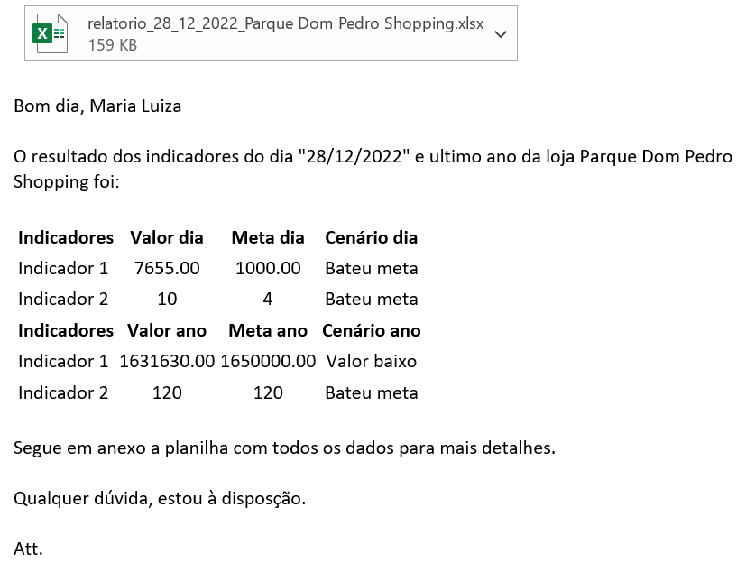

# Automação de Indicadores  

### Descrição:

Todo dia, pela manhã, deve ser realizado a análise de dados a fim de calcular o One Pages e enviar para o gerente de
cada loja o One Page de sua loja, bem com todas informações usadas no cálculo dos indicadores.

Um One Page é um resumo muito simples e direto ao ponto, para saber os principais indicadores de cada loja  em 1 página 
(daí o nome OnePage) tanto a comparação entre diferentes lojas, quanto quais indicadores aquela loja conseguiu cumprir 
naquele dia ou não.

E esse projeto seria para criar um processo de ánalise de dados da forma mais automática possível para calcular o 
OnePage de cada loja e enviar um e-mail para o gerente de cada loja com o seu OnePage no corpo do e-mail e também o 
arquivo completo com os dados da sua respectiva loja em anexo.

### O que temos?

Temos os dados de uma grande rede lojas com 25 lojas espalhadas por todo Brasil.

- Registro de todas as vendas de cada unidade do período de um ano
- E-mail de contato de todos os gerentes de cada unidade
- Indentificação de cada loja

### Exemplo One Page:
